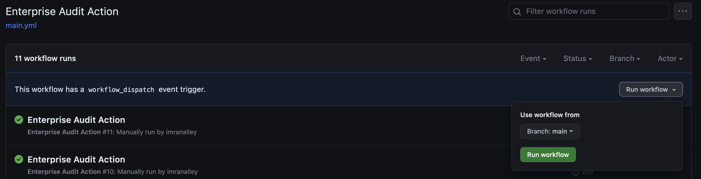

### Why you need an audit action

Nobody likes Auditing. Even the auditing team (if you had a chance to ask them). The reason? Zero traceability of artifacts, attestations can be lost in transit, the bureaucratic nature of approvals and administration, just to name a few. One of the most common auditing scenarios is to audit repos where devs, ops, admins, and QA all work within the same repository. How can we keep track of changes to access levels within this repo in an automated way? Enter GitHub Actions.

### Auditing within GitHub

GitHub already has audit capabilities built in with [Audit Log](https://docs.github.com/en/enterprise-cloud@latest/admin/monitoring-activity-in-your-enterprise/reviewing-audit-logs-for-your-enterprise/about-the-audit-log-for-your-enterprise). The problem with this is that the built in search functionality would be manual work for your administrators. If a team ever had to do a quick audit on their repo, they would also have to reach out to the enterprise admins of their GitHub instance. Why create more tickets when this can be self-serviced and automated?

### Creating the Action


The [Enterprise Audit Action](https://github.com/imranalley/enterprise-audit-action) can be onboarded to very quickly. 

1. Clone the repo to your github enterprise instance's [./actions](https://docs.github.com/en/enterprise-cloud@latest/actions/creating-actions/sharing-actions-and-workflows-with-your-enterprise) repo. 
2. Users can copy and paste the following to their [.github/workflows](https://docs.github.com/en/actions/using-workflows/about-workflows#create-an-example-workflow) folder:



name: Enterprise Audit Action
on:
  workflow_dispatch:

jobs:
  audit:
    runs-on: ubuntu-latest

    steps:
      # Checks-out your repository under $GITHUB_WORKSPACE, so your job can access it
      - uses: actions/checkout@v3

      # Use Enterprise Audit Action
      - name: Run a one-line script
        uses: # Enter the location where your ./actions repo is
        with:
          token: ${{ secrets.GH_TOKEN }}
          organization: # Org Name
          repository: # Repo Name
          owner: # Owner Name
          team: # Team Name
          user: # User's Name
          audit: # Audit use case (must be 1 of the following: org, repo, team, or user)
          instance: # API endpoint as per your Enterprise GitHub Instance (public: https://api.github.com/graphql)

      - name: Publish CSV Report
        uses: actions/upload-artifact@v2
        with:
          name: ghe-acl
          path: ghe-acl*.csv


Feel free to edit other settings such as triggering the workflow every day on a cron schedule. 


**The token (L17) must have admin access based on the audit use case. If you are auditing at an organization level, the token must have admin access to the organization being audited.**


3. Run the workflow in your actions tab!
