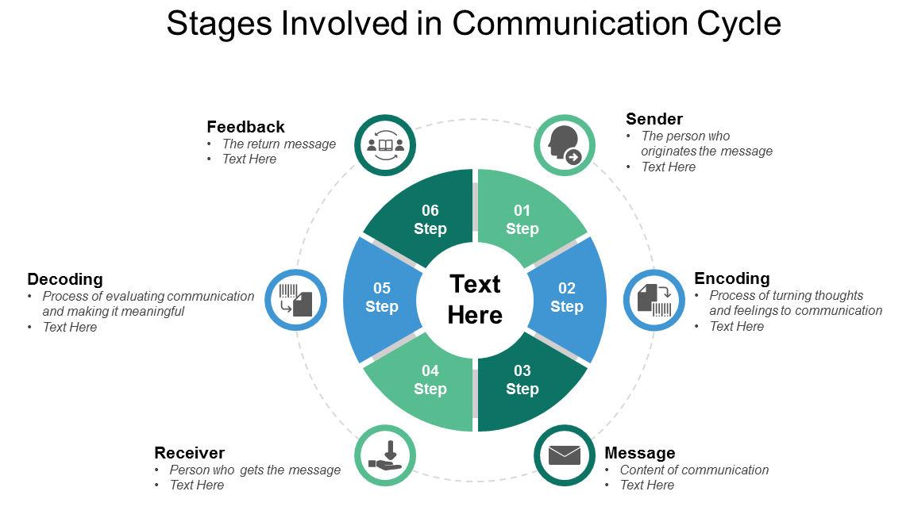
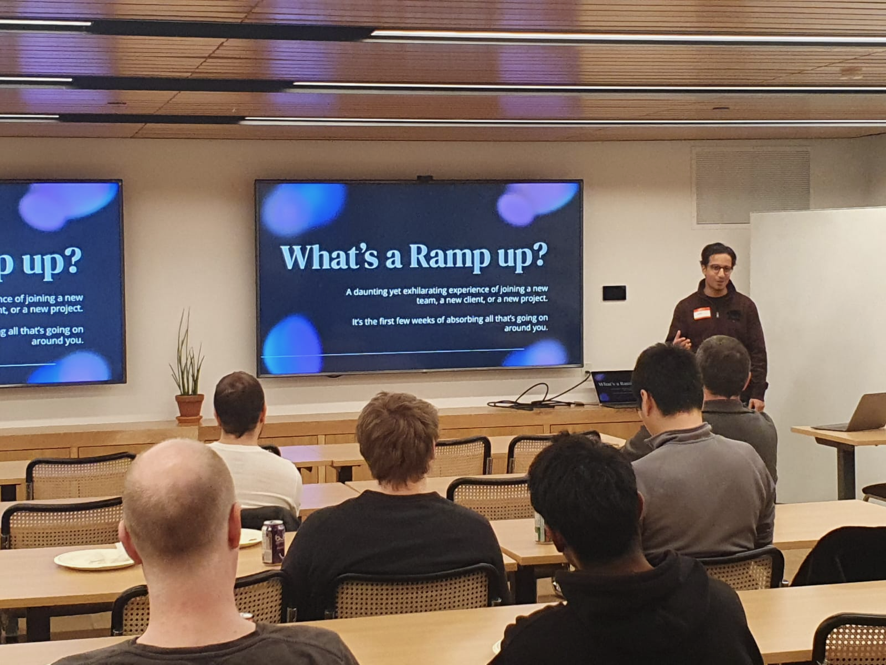
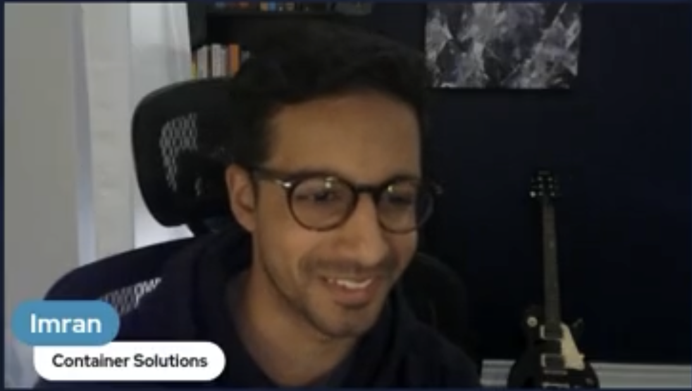

## The Start of a Journey
For the longest time, I had a fear of public speaking. When I was promoted to a Senior DevOps Consultant role, I was thrown into a bunch of calls around cloud architecture and solutions that would fit an entire enterprise of 40,000+ employees. Needless to say, it was absolutely daunting. I was faced with the day-to-day tasks of talking with directors, managers, other senior engineers on my personal viewpoints when it came to engineering solutions. I quickly came to realize that improving my public speaking skills would greatly benefit not just my career but my whole life. Having an idea and then having the ability to communicate the idea to someone else effectively without little to no information loss is a SUPERPOWER and I wanted it.

Cue October 2022, when I signed up for a public speaking course at [Speakwell](https://www.letsspeakwell.com/). My coach, Jordyn, and I went through my biggest pain points when I came to public speaking. They revolved around communication structure, clarity, and mindset.

## My Learnings

* Having structures on command that you can use to articulate ideas
  * This involves ordering information in the following structures:
    * Chronological: Past, Present, Future
    * Numerical: 1, 2, 3
    * Cost, Benefits, Analysis
    * Cause/Effect: Cause, Short Term Effects, Long Term Effects
* Reducing Filler words and being comfortable with a pause
* Having a growth mindset and being able to brush off mistakes/hiccups when it comes to public speaking

From my learnings, I went on to talk in a Software Circus where we chat about technical and non-technical topics. Afterwards, I had the opportunity to host the first ever Software Circus in Toronto as well! The team also knew of my goals when it came to public speaking and would pass my name along for opportunities to join webinars and internal conference calls. You can see one of the webinars with the [Uptime community here](https://www.linkedin.com/events/stuckwithjenkins-hearhowthesede7043938897755607040/comments/).


  
  
  


Overall, improving my public speaking was one of the best undertakings of my career and it’s a lifelong learning process. If you’re looking for someone to speak at a conference/webinar you’re organizing, feel free to reach out!
